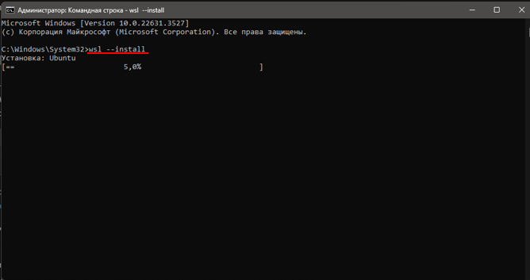
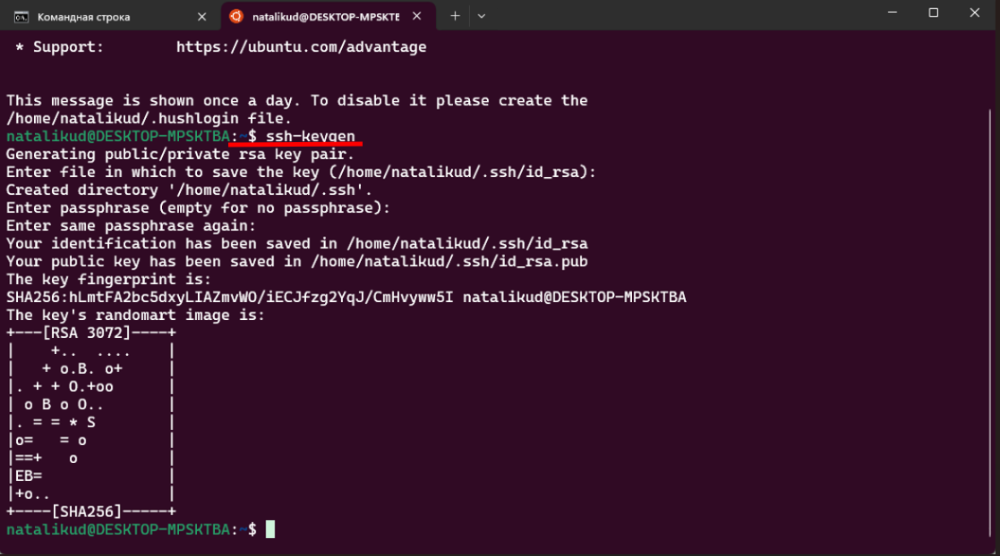
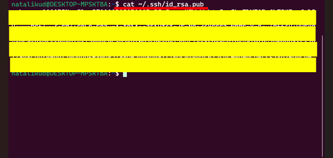
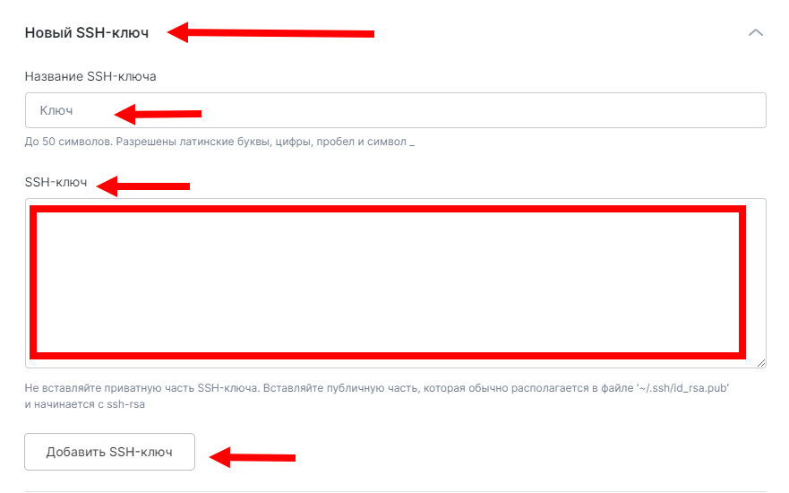

# Описание backend:

Разработка backend с использованием Django и PostgreSQL.
При разработке облачного хранилища используются следующие пакеты :

asgiref==3.7.2
cffi==1.16.0
cryptography==41.0.7
Django==5.0.1
django-cleanup==8.0.0
django-cors-headers==4.3.1
djangorestframework==3.14.0
gunicorn==21.2.0
packaging==23.2
pillow==10.2.0
psycopg2-binary==2.9.9
pycparser==2.21
python-dotenv==1.0.0
pytz==2023.3.post1
sqlparse==0.4.4
typing_extensions==4.9.0

Указанные пакеты перечислены в файле requiremets.txt
Загружаемые в личном кабинете пользователей файлы сохраняются в папке backend/media/user_files
Загружаемые в личном кабинете пользователей аватары сохраняются в папке backend/media/avatars
Пример для настройки данных окружения находятся в папке .env_example
Ошибки и логи сохраняются в файлах errors.py и logs.py

## ВАЖНО:

перед отправкой проекта (бэк и фронт) на сервер reg.ru необходимо сделать сборку фронт-проекта заранее.
в папке проекта Frontend в терминале необходимо сделать запуск команды

```bash
npm build
```

## Развёртывание сервера на платформе reg.ru

## Установка wsl (в случае работы на Windows)

В случае работы на операционной системе Windows необходимо установить дополнительно пакет wsl для windows. (Позволяет работать в терминале ubuntu и использовать команды linux для последующей загрузки проекта на сервер Reg.ru).

В ТЕРМИНАЛЕ WINDOWS:

```bash
wsl --install
```



После установки произойдет запуск ubuntu, необходимо установить имя и пароль для пользователя ubuntu.

Проверить установку wsl можно командой в терминале windows:

```bash
wsl --version
```

## Создание ключа SSH

В ТЕРМИНАЛЕ UBUNTU:
Открываем терминал ubuntu. Для доступа к управлению сервером генерируем SSH на локальной машине:

```bash
ssh-keygen
```


Далее необходимо получить публичный ключ SSH (понадобится при создании сервера для проекта), делаем запрос командой в терминале :

```bash
cat ~/.shh/id_rsa.pub
```



## Создание адреса сервера

Проходим регистрацию на сайте [reg.ru](https://www.reg.ru)

Приступаем к созданию нового сервера:  


Добавляем наш ssh в соответствующее поле при создании сервера:  


После отправки запроса на создание сервера в строке с названием сервера появится статус АКТИВЕН:  


На указанную при регистрации почту приходит ip и пароль для управления сервером.

## Подключаемся к адресу сервера через терминал UBUNTU

Заходим через консоль на сервер :

```bash
ssh root@0.0.0.0
```

, где 0.0.0.0 - ip-адрес созданного сервера.

Далее по запросу вводим пароль и получаем root доступ к системе сервера:  


Создаем нового пользователя, чтоб с root правами ничего не "сломать":

```bash
adduser user
```

, где вместо user вводим имя нового пользователя (natalikud). Задаем пароль, задаем данные о пользователе(можно оставить пустыми), подтверждаем правильность введенных данных - пользователь создан.

Наделяем вновь созданного пользователя правами superuser(su):

```bash
usermod user -aG sudo
```

, где вместо user вводим имя нового пользователя(natalikud).

Переподключаемся на вновь созданного пользователя:

```bash
logout
ssh user@0.0.0.0
```

, где вместо user вводим имя нового пользователя(natalikud), вместо 0.0.0.0 вводим ip созданного сервера.

Теперь всю работу делаем находясь под вторым пользователем natalikud.

## Установка всех необходимых пакетов на виртуальный сервер

Перед установкой обновляем список репозиториев:

```bash
sudo apt update
```

Рекомендуется так же установить последние стабильные версии установленных пакетов, это может занять определенное количество времени 15-20 минут:

```bash
sudo apt upgrade
```

Некоторые пакеты , например python и git, являются предустановленными на сервере, проверить их версии можно командой :

```bash
python3 --version
```

```bash
git --version
```

Устанавливаем остальные необходимые пакеты, запросит пароль от действующего пользователя ip, под которым мы работаем:

```bash
sudo apt-get install python3 python3-venv python3-pip postgresql nginx
```

проверяем активацию postgres, при установке он должен автоматически запуститься:

```bash
sudo systemctl status postgresql
```

должен быть статус active. В случае, если не активен, вводим команду

```bash
sudo systemctl start postgresql
```

проверяем активацию nginx

```bash
sudo systemctl start nginx
```

```bash
sudo systemctl status nginx
```

должен быть статус active.

## добавляем папку проекта на виртуальный сервер, командой git clone

проверяем место положение, мы должны быть в домашней директории

```bash
pwd
```

В домашней директории пользователя клонируем репозиторий нашего проекта

```bash
git clone url
```

, где url - адрес https нашего проекта на github

## создаем виртуальное окружение для бэкэнда

опускаемся по папкам проекта до директории с файлом manage.py
смотрим список папок, выбираем нужную папку

```bash
ls
```

переходим в backend

```bash
cd backend
```

, затем устанавливаем и активируем виртуальное окружение:

```bash
python3 -m venv .venv
source .venv/bin/activate
```

Далее устанавливаем все пакеты из requirements.txt и проверяем их установку:

```bash
pip install -r requirements.txt
```

Проверяем установку

```bash
pip freeze
```

## Настройка пользователя psql и базы данных проекта

Создаем пользователя в psql, имя которого соответствует имени пользователя в системе:

```bash
sudo su postgres
psql
CREATE USER user WITH SUPERUSER;
ALTER USER user WITH PASSWORD '...';
CREATE DATABASE user;
```

, где вместо user вводим имя пользователя в системе (natalikud) , под которым работаем сейчас (это тот второй безопасный пользователь сервера), вместо ... - придумать пароль (natalikud).

важно: здесь нужно создать системную базу данных с тем же именем, что и имя пользователя(natalikud), которого только что создали в psql.
**Имя пользователя и название системной БД должны совпадать (инструкция преподавателя из лекции)!**

Выходим из psql и подключаемся обратно через пользователя user и создаем базу данных для проекта:

```bash
\q
exit
psql
CREATE DATABASE name;
\q
```

, где вместо name вводим имя БД проекта (new_db2).

## Настройка settings

```bash
nano backend/settings.py
```

открывается редактор кода, здесь указываем имя БД new_db2.
user = natalikud (тот пользователь базы данных, которого мы создали на сервере)
password = natalikud (тот пароль от пользователя psql , которого мы создали)

или
создаем отдельный файл, если используем переменные окружения в нем, а все данные отсюда прописываем в settings через os.getenv
Создаем файл .env (в корневой папке с файлом manage.py)

```bash
nano .env
```

и прописываем переменные окружения. Пример:

**TODO:ДОБАВИТЬ КАРТИНКУ ПОЗЖЕ**


ALLOWED_HOSTS = 'указываем адрес ip с сайта reg.ru' или [*]

Проверяем корректное использование переменного окружения в настройках и сами настройки проекта в файле settings.py.  
Запускаем миграции и загружаем данные из заранее подготовленного файла loaddata.json:

```bash
python manage.py migrate
python manage.py loaddata loaddata.json
```

Если миграции не прошли - перепроверяем настройки!

## gunicorn

Далее настраиваем gunicorn в соответствии с примером из записи вебинара:

проверка wsgi (не надо)

```bash
gunicorn backend.wsgi -b 0.0.0.0:8000
```

настраиваем gunicorn

```bash
sudo nano /etc/systemd/system/gunicorn.service
```

Настройки на данном проекте:  
**TODO:ДОБАВИТЬ КАРТИНКУ ПОЗЖЕ**


Проверка правильности настроек:

```bash
sudo systemctl start gunicorn
sudo systemctl enable gunicorn
sudo systemctl status gunicorn
```

Если все настройки прописаны верно - после ввода последней команды мы увидим, что gunicorn активен:  
**TODO:ДОБАВИТЬ КАРТИНКУ ПОЗЖЕ**


## сборка проекта на локальной машине npm build

Если сборка frontend-а не была произведена: на локалньном ресурсе производим сборку, удаляем папку build из .gitignore, коммитим и сохраняем/отправляем изменения на удаленном репозиторий и подтягиваем изменения со сборкой на облачный сервер.

## nginx

Теперь перейдем к настройкам nginx.  
Создадим новый файл, можно без расширения, имя выбираем самостоятельно:

```bash
sudo nano /etc/nginx/sites-available/cloud
```

прописываем настройки.

Настройки на данном проекте:
**TODO:ДОБАВИТЬ КАРТИНКУ ПОЗЖЕ**
  
где также задается путь к изображениям - 'location /media/'.

Cоздаем символическую ссылку на этот файл в другую директорию:

```bash
sudo ln -s /etc/nginx/sites-available/cloud /etc/nginx/sites-enabled
```

Настраиваем максимальнвй размер присылаемых файлов. Для этого заходим в основные настройки сервера:

```bash
sudo nano /etc/nginx/nginx.conf
```

и устанавливаем необходимый размер(в данном примере 5мб), добавив записи в http{}  
client_max_body_size 5M;  
client_body_buffer_size 5M;

Перезапускаем сервер nginx и проверяем статус:

```bash
sudo systemctl stop nginx
sudo systemctl start nginx
sudo systemctl status nginx
```

Для корректировки и отладки настроек используем логи nginx:

```bash
sudo nano /var/log/nginx/access.log
sudo nano /var/log/nginx/error.log
```

Если все сделали правильно - увидим статус 'active':
**TODO:ДОБАВИТЬ КАРТИНКУ ПОЗЖЕ**


в лекции дополнительно

```bash
sudo ufw allow 'Nginx Full'
```

из папки с manage.py

```bash
python manage.py collectstatic
```

## Запуск сервера

```bash
python manage.py runserver
```

После всех, перечисленных выше, действий все должно заработать по ip адресу в адресной строке браузера:  
**TODO:ДОБАВИТЬ КАРТИНКУ ПОЗЖЕ**

