## Описание frontend

Frontend облачного хранилища разработан с использованием React и пакетного менеджера npm.

Пакеты, используемые при разработке:

"@reduxjs/toolkit": "^2.2.3",
"@testing-library/jest-dom": "^5.17.0",
"@testing-library/react": "^13.4.0",
"@testing-library/user-event": "^13.5.0",
"dateformat": "^5.0.3",
"file-saver": "^2.0.5",
"localforage": "^1.10.0",
"react": "^18.3.1",
"react-dom": "^18.3.1",
"react-redux": "^9.1.1",
"react-router-dom": "^6.23.0",
"react-scripts": "5.0.1",
"redux": "^5.0.1",
"redux-saga": "^1.3.0",
"tailwindcss": "^3.4.3",
"web-vitals": "^2.1.4"

## Перед загрузкой проекта на github и сервер

Перед загрузкой проекта на github и сервер необходимо сделать сборку на локальной машине и загрузить папку build на github (предварительно убрать из .gitignore, чтобы папка попала в репозиторий)

либо

осуществить сборку на виртуальном сервере (см.инструкцию README в описании backend)

```bash
npm build
```

## Функционал приложения

## Вход/регистрация

Страница входа в облачное хранилище:
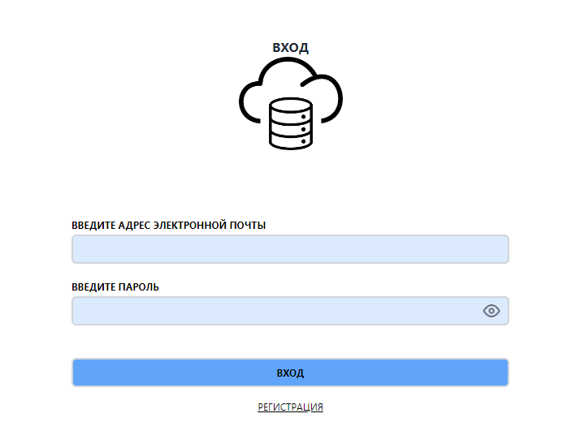

Ошибка входа:
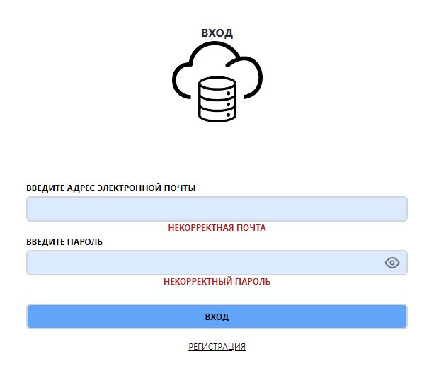

Регистрация:
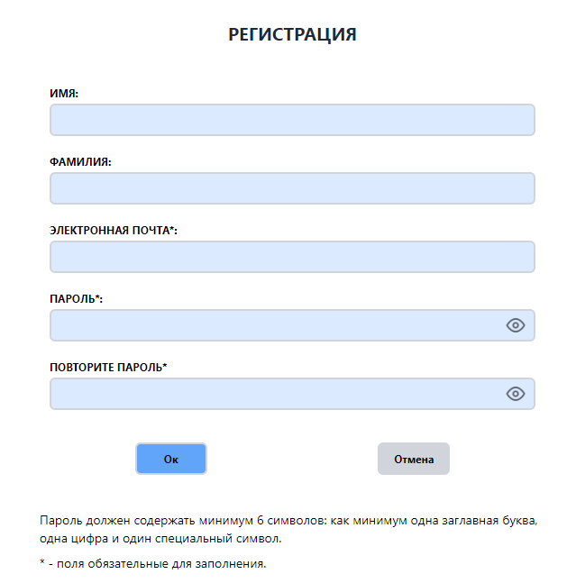

Ошибка регистрации:
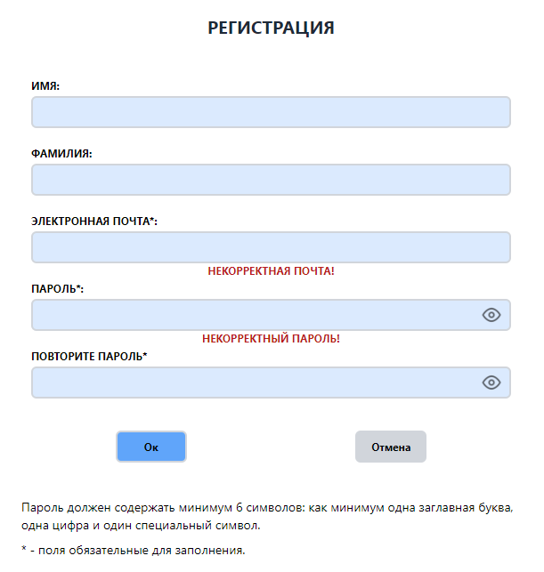

Успешная регистрация
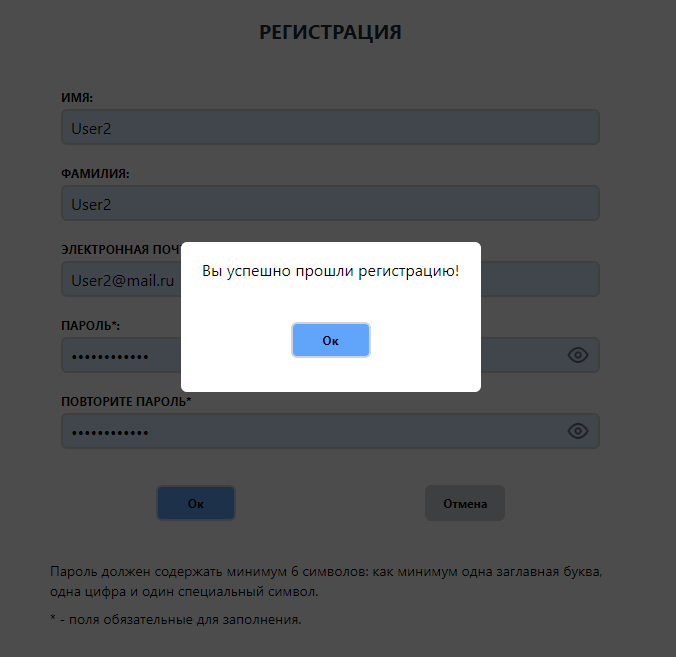

## Администратор

Аккаунт администратора/список пользователей хранилища, управление списком пользователей и файлами пользователей:
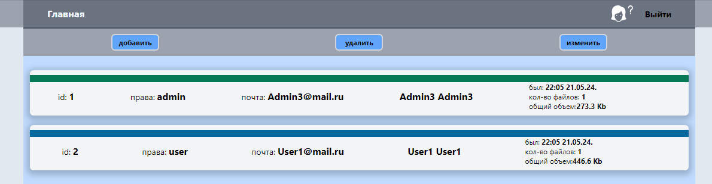

Карточка администратора и хранилище администратора:
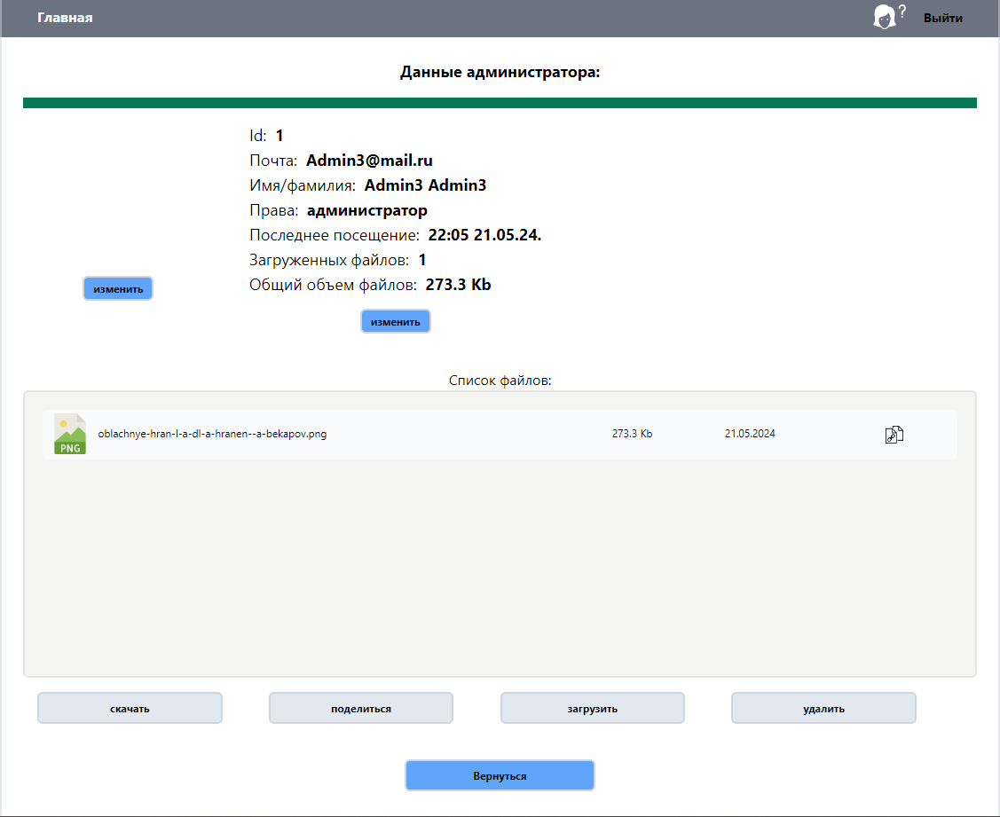

## Пользователь

Аккаунт пользователя/хранилище/расположение плиткой и кнопки управления файлами хранилища:
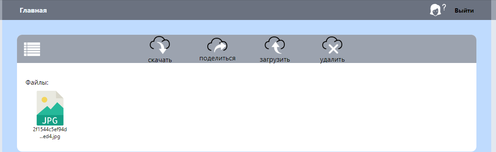

Аккаунт пользователя/хранилище/расположение списком и кнопки управления файлами хранилища:
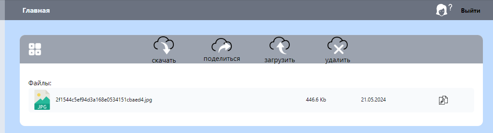

Данные пользователя:
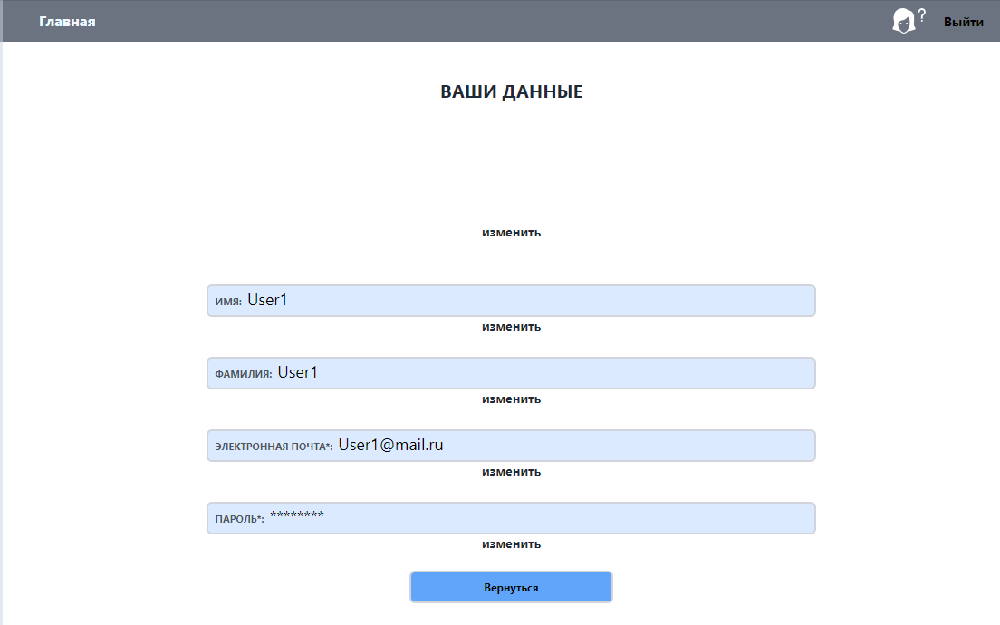

## Дополнительная информация

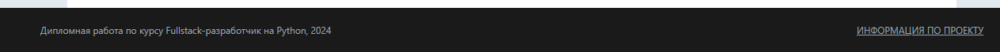
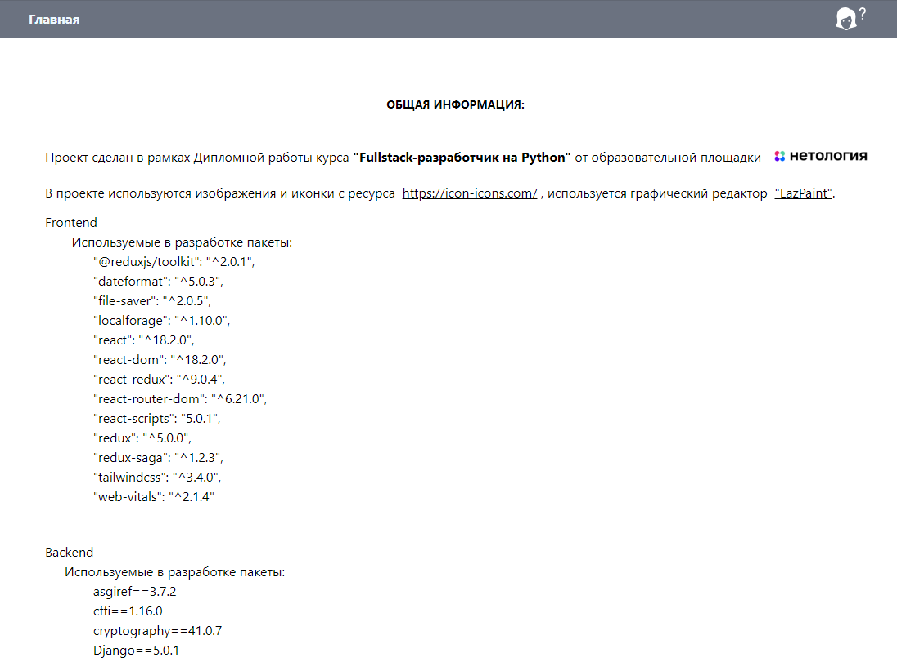
